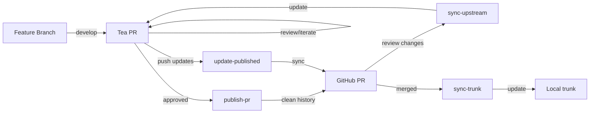

# Capabilities

## Specs

Specs are a structured multi-phase workflow for feature development that breaks complex features into manageable, well-documented steps. The spec system uses EARS (Easy Approach to Requirements Syntax) for precise requirement specification and ensures thorough planning before implementation.

## Spec Phases

1. **Requirements** - Gather and refine feature requirements using EARS format
2. **Design** - Create detailed technical design with research and architecture
3. **Implementation Plan**  - Break design into actionable coding tasks
4. **Task Execution** - Execute individual tasks from the implementation plan

## File Structure

Specs are organized under `.claude/specs/{feature_name}/` OR `specs/{feature_name}/` with:

- `requirements.md` - EARS-formatted requirements with user stories and acceptance criteria
- `tasks.md` - Numbered checklist of specific coding tasks that build incrementally

When reading 1 spec file for a feature you MUST read BOTH spec files. Other artifacts are optional.

# Rules

## Concurrent Agent Execution

**CRITICAL**: When spawning multiple agents using the Task tool, ALWAYS invoke them CONCURRENTLY in a SINGLE MESSAGE. Never spawn agents sequentially across multiple messages. This applies to:

- Research agents analyzing different topics
- PR review agents checking different aspects
- Any multi-agent workflow

Example:

```python
# CORRECT - All in ONE message:
Task("Agent 1", "First task...", "agent-type")
Task("Agent 2", "Second task...", "agent-type")
Task("Agent 3", "Third task...", "agent-type")
```

## Always Fetch URLs When Provided

**CRITICAL**: When a user provides a URL in their message, **ALWAYS** use the Fetch tool to retrieve and analyze the content before proceeding. This ensures you have the most current and accurate information to assist effectively. **Fetch URLs even if they seem familiar or if you think you know the content.**

## Perplexity for Web Search

Use perplexity for searching the web. Perplexity provides additional search results with AI-powered analysis and real-time information retrieval**

**Important: Perplexity will provide you citations for your search results. Use the Fetch tool to retrieve additional information from these resources to better your understanding.**

The Perplexity MCP provides the `perplexity_search_web` tool with recency filtering:

```
mcp__perplexity-mcp__perplexity_search_web
- query (required): Your search query
- recency (optional): Filter by time - "day", "week", "month" (default), or "year"
```

## Git Actions

### Gitea/Tea Workflow (Local Development)



- **Primary Development**: ALL feature development happens on local Gitea (git.hollow.dev) FIRST
- **Collaboration Space**: Tea is our private collaboration space - iterate freely without public exposure
- **Branch Convention**: Use `trunk` as default branch for all Gitea repos
- **No Direct Push**: NEVER push to GitHub until work is approved

### Publishing Workflow (Tea → GitHub)

- **Clean History**: Use `/tea/publish-pr` to create production-ready branches with atomic commits
- **Sync During Review**: Use `/tea/sync-upstream` and `/tea/update-published` for review cycles
- **Trunk Management**: Local trunk MUST mirror upstream - use `/tea/sync-trunk` regularly
- **Cleanup After Merge**: Close both Tea and GitHub PRs, delete branches on both remotes

### GitHub Workflow (Public Repositories)

- You MUST ALWAYS fetch GitHub PRs with the `gh` command line instead of fetching
- You MUST ALWAYS uses `--repo` flag with `gh` to ensure compatibility with both GitHub.com and GitHub Enterprise instances
- You MUST ALWAYS use short git commit messages (less than 75 chars)

**Full workflow documentation**: `~/.claude/docs/tea-github-workflow.md`
