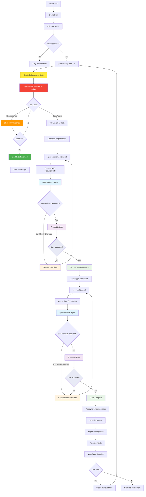

# Plan Mode and Spec Integration

This document describes how plan mode integrates with the spec workflow.

## Overview

When you create a plan using plan mode, it automatically integrates with the spec system to generate structured requirements and tasks.

## Configuration

The system uses `config/spec.json` to configure where specs are stored:

- Project-level: `.claude/config/spec.json`
- Global: `~/.claude/config/spec.json`
- Default: `.claude/specs/`

Example `config/spec.json`:

```json
{
  "specs_path": ".claude/specs/"
}
```

## Workflow

1. **Create Plan**: Enter plan mode and draft your plan
2. **Plan Saved**: Hook creates `{spec-folder}/{slug}/plan.md`
3. **Approve Plan**: Review and approve the plan
4. **Enforcement Activated**: System blocks non-spec actions until requirements generated
5. **Requirements**: Generate requirements from approved plan (enforced)
6. **Tasks**: spec-tasks agent automatically creates task breakdown
7. **Implementation**: Manually trigger implementation when ready

## Workflow Enforcement System

The system includes automatic enforcement to ensure spec workflows are completed properly.



### How Enforcement Works

1. **Plan Approval Triggers Enforcement**: When a plan is approved, the system creates an enforcement state that blocks non-spec actions
2. **Helpful Blocking**: Attempts to use other tools show clear guidance on what needs to be done next
3. **Spec Actions Allowed**: Only spec-related agent tasks are permitted until requirements are generated
4. **Automatic Clearing**: Enforcement clears once the spec workflow is properly initiated

### Enforcement Bypass: Vibe Check

Sometimes you need to explore or work on other tasks while a spec is pending:

#### `/spec:vibe` - Disable Enforcement
```bash
/spec:vibe
```

- Disables spec workflow enforcement for the current session
- Removes any pending plan approval state files  
- Allows normal tool usage without spec workflow blocking
- **Per-plan-cycle scope**: Automatically re-engages when a new plan is approved

#### `/spec:enforce` - Re-enable Enforcement  
```bash
spec-enforce
```

- Re-enables spec workflow enforcement for the current session
- Restores normal blocking behavior
- Any existing pending plan states become active again

### Enforcement Scope

- **Session-specific**: Each Claude session has independent enforcement state
- **Per-plan-cycle**: Vibe check applies only to the current plan approval cycle
- **Automatic reset**: New plan approvals clear previous vibe disable state

## Plan Mode Hooks

### plan-extractor.sh

- Triggered when exit_plan_mode is called
- Extracts plan content and H1 title
- Uses Claude Code SDK to generate kebab-case slug
- Creates spec folder structure
- Saves plan.md with minimal frontmatter (session_id, status: draft)

### plan-cleanup.sh

- Triggered after plan approval
- Completely overwrites plan.md with approved version
- Updates status to "approved"
- **Creates enforcement state file**: `plan-approved-$SESSION_ID`
- **Clears vibe disable**: Removes any existing vibe check for new plan cycle
- Prompts for spec generation workflow

### spec-workflow-enforcer.sh

- Triggered on PreToolUse for any tool
- Checks for pending plan approval state
- Blocks non-spec actions with helpful guidance
- Allows spec-related agents (spec-requirements, general-purpose, spec-reviewer)
- Respects `CLAUDE_DISABLE_HOOKS=1` environment variable

### slash-command-handler.sh

- Triggered on UserPromptSubmit 
- Detects `/spec:vibe` and `/spec:enforce` commands  
- Calls appropriate bash scripts with session context
- Provides session-specific enforcement control

## Agent Chain

The agents work together automatically:

- `spec-requirements` → validates with `spec-reviewer` → on approval →
- `spec-tasks` → validates with `spec-reviewer` → suggests implementation

### spec-requirements Agent

- Reads approved plan.md
- Generates EARS-formatted requirements
- Validates with spec-reviewer
- Iterates with user until approved
- Triggers spec-tasks on approval

### spec-tasks Agent

- Reads approved requirements.md
- Creates atomic implementation tasks
- Validates task breakdown
- Suggests /spec/03-implement when complete

## Manual Control Points

Users maintain control at key points:

- Plan approval
- Requirements approval
- Tasks approval
- Implementation start (`/spec/03-implement`)
- Completion (`/spec/04-complete`)

## Slug Generation

The system generates clean folder names from plan titles:

1. Claude Code SDK converts to kebab-case
2. Banned characters removed: `# ^ [ ] |`
3. Fallback to manual generation if SDK fails

Example: "User Authentication System" → "user-authentication-system"

## Directory Structure

```
project/
├── .claude/
│   ├── spec.json (optional)
│   ├── state/
│   │   ├── plan-approved-{session-id}     # Enforcement state
│   │   └── spec-disabled-{session-id}     # Vibe check state
│   └── specs/
│       └── user-authentication/
│           ├── plan.md
│           ├── requirements.md
│           └── tasks.md
```

## State Management

The system uses session-specific state files in `.claude/state/`:

### Enforcement State Files

- **`plan-approved-{session-id}`**: Created when plan is approved, contains path to approved plan
- **`spec-disabled-{session-id}`**: Created by `/spec:vibe`, disables enforcement for session
- **Automatic cleanup**: Vibe state cleared when new plan approved

### Hook Disable System

Inner Claude calls use `CLAUDE_DISABLE_HOOKS=1` to prevent hook recursion:

```bash
# In plan-cleanup.sh
SLUG=$(CLAUDE_DISABLE_HOOKS=1 claude -p "Convert title..." 2>/dev/null)
```

All hooks check for this variable and exit early if set.

## Available Commands

### Spec Commands

- **`/spec:implement`**: Start implementation phase with task breakdown
- **`/spec:complete`**: Mark spec implementation as complete
- **`/spec:vibe`**: Disable workflow enforcement for current session
- **`/spec:enforce`**: Re-enable workflow enforcement for current session

### Development Workflow

1. **Plan Phase**: Use plan mode → automatic spec folder creation
2. **Requirements Phase**: Automatic after plan approval (enforced)
3. **Implementation Phase**: Manual trigger via `/spec:implement`
4. **Completion Phase**: Manual trigger via `/spec:complete`

### Enforcement vs. Manual Control

- **Automatic enforcement**: Plan → Requirements (prevents forgetting)
- **Manual control**: Requirements → Implementation → Completion (safety)
- **Flexible bypass**: `/spec:vibe` for exploration needs

The system balances automatic workflow guidance with developer control and flexibility.
