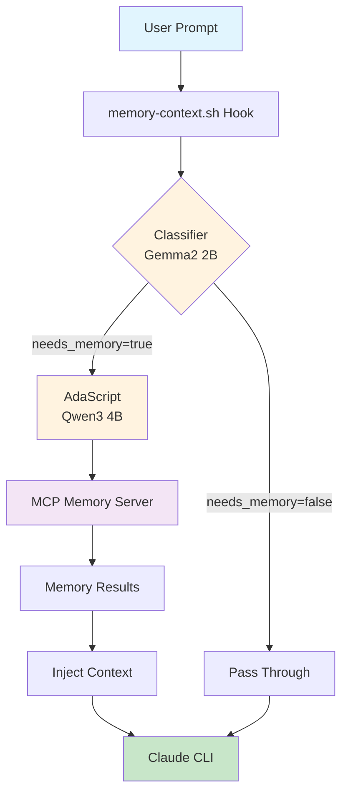

# Claude Memory System

A local LLM-powered memory system for Claude Code that provides contextual memory injection using Ollama and MCPHost. Memory is stored in `~/.claude/memory.jsonl` and shared with Claude Code's MCP integration.

## Overview

This memory system automatically detects when Claude needs context from previous conversations or stored knowledge, and injects relevant information into prompts. It uses local models via Ollama for classification and AdaScript for MCP-based memory retrieval.

## Architecture



## Components

### Scripts

- **`bin/memory-classifier`** - Classifies if a prompt needs memory context
  - Uses Ollama with Gemma2 2B model for fast classification
  - Returns JSON with confidence score and search terms

- **`bin/memory-search-agent`** - AdaScript script that queries memory
  - Uses Qwen3 4B model by default
  - Communicates with mcp-knowledge-graph server via stdio
  - May output thinking tags with newer models

- **`bin/memory-search`** - Wrapper that strips thinking tags
  - Removes `<think>...</think>` tags from model output
  - Preserves thinking tags in debug logs when MEMORY_HOOK_DEBUG=true
  - Redirects all debug output to log file (no console output)
  - Used by memory-context.sh hook

### Utilities

- **`utils/config.sh`** - Unified configuration for all scripts
- **`utils/debug-log.sh`** - Debug logging functionality
- **`utils/json-extract.sh`** - JSON parsing utilities
- **`utils/ollama-api.sh`** - Ollama API interaction

### Configuration

All configuration is centralized in `utils/config.sh`:

#### Environment Variables

- **`MEMORY_HOOK_DEBUG`** - Enable debug mode (default: false)
- **`MEMORY_HOOK_LOG`** - Debug log file path (default: /tmp/claude-memory-hook.log)
- **`OLLAMA_HOST`** - Ollama API endpoint (default: <http://localhost:11434>)
- **`MEMORY_CONFIDENCE_THRESHOLD`** - Minimum confidence for memory injection (default: 0.7)

#### Settings in config.sh

- **`MEMORY_CLASSIFIER_MODEL`** - gemma2:2b-instruct-q4_K_M
- **`MEMORY_SEARCH_MODEL`** - qwen3:4b
- **`MEMORY_BIN_DIR`** - ${HOME}/.claude/memory/bin
- **`MEMORY_UTILS_DIR`** - ${HOME}/.claude/memory/utils

## Prerequisites

1. **Ollama** - Local LLM runtime

   ```bash
   # Install Ollama from https://ollama.ai
   # Pull required models
   ollama pull gemma2:2b-instruct-q4_K_M
   ollama pull qwen3:4b  # or qwen3:4b for less resource usage
   ```

2. **AdaScript** - Lightweight automation tool with MCP support

   ```bash
   # Install from source
   git clone https://github.com/emdashcodes/adascript.git
   cd adascript
   go build -o adascript
   ln -sf "$(pwd)/adascript" ~/bin/adascript  # or add to PATH
   ```

3. **Node.js/npm** - For MCP memory server
   - Required for `npx` to run the MCP memory server

4. **mcp-knowledge-graph** - The MCP memory server
   - Automatically installed via npx when needed

## Installation

1. Ensure prerequisites are installed
2. Add Go binaries to PATH (already added to ~/.zshrc):

   ```bash
   export PATH="$HOME/go/bin:$PATH"
   ```

3. Enable the memory hook in Claude CLI settings (`~/.claude/settings.json`):

   ```json
   "UserPromptSubmit": [
     {
       "matcher": "*",
       "hooks": [
         {
           "type": "command",
           "command": "~/.claude/hooks/memory-context.sh"
         }
       ]
     }
   ]
   ```

4. Configure Claude Code MCP integration:

   ```bash
   # Add memory server to user scope (available across all projects)
   claude mcp add memory -s user npx -- -y mcp-knowledge-graph --memory-path ~/.claude/memory.jsonl
   
   # Verify it's connected
   claude mcp list
   ```

## How It Works

1. **Hook Intercepts Prompt** - The memory-context.sh hook receives user prompts
2. **Classification** - Gemma2 2B quickly determines if memory is needed (~200-500ms)
3. **Memory Search** - If needed, AdaScript runs with Qwen3 4B model
4. **MCP Communication** - AdaScript connects to the MCP memory server
5. **Context Injection** - Relevant memory is prepended as plain text
6. **Claude Processing** - Claude receives the enriched prompt with memory context

## Usage

The system works automatically once configured. To test components individually:

```bash
# Test classifier
echo "Where does Em work?" | memory/bin/memory-classifier

# Test memory search directly (strips thinking tags)
~/.claude/memory/bin/memory-search --model "qwen3:4b" \
  --args:USER_PROMPT "who am i?" --quiet

# Test memory search agent (raw output with thinking tags)
adascript script ~/.claude/memory/bin/memory-search-agent \
  --args:USER_PROMPT "who am i?"

# Use MCP tools directly in Claude Code
# The memory server provides tools like:
# - mcp__memory__create_entities
# - mcp__memory__search_nodes
# - mcp__memory__add_observations
# - mcp__memory__create_relations

# Enable debug mode
export MEMORY_HOOK_DEBUG=true
```

### Debug Mode

Enable comprehensive logging:

```bash
export MEMORY_HOOK_DEBUG=true
export MEMORY_HOOK_LOG=/tmp/claude-memory-hook.log  # optional, this is the default
```

When debug mode is enabled:

- All debug messages go to the log file (not to console)
- Model thinking tags are preserved in the log
- Clean output is still provided to Claude CLI

View debug logs:

```bash
tail -f /tmp/claude-memory-hook.log
```
